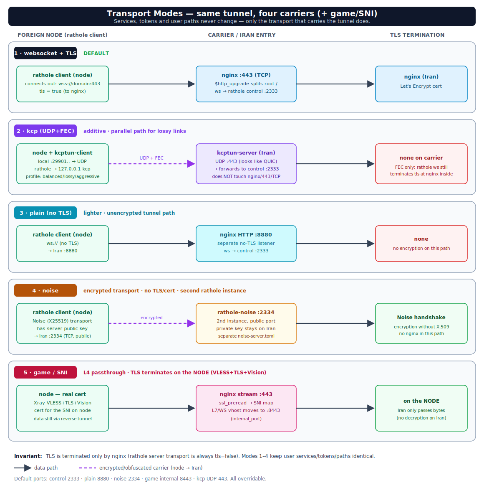

<div align="center">


# RatholeEngine

**Multi-location reverse-tunnel system on rathole + Nginx**

_One port · one domain · one certificate · many foreign nodes routed by URL path._
_Built for censorship-resistant tunneling into Iran._

<!-- badges -->
[](https://github.com/loopy-iri/RatholeEngine/actions/workflows/ci.yml)
[](https://github.com/loopy-iri/RatholeEngine/releases/latest)
[](https://github.com/loopy-iri/RatholeEngine/stargazers)
<br/>


[**English**](#what-is-this) · [**فارسی**](docs/README.fa.md) · [Quick start](#quick-start) · [Docs](#documentation)

</div>

> The CLI tools live under [`rathole-manager/`](rathole-manager/). For the full Persian reference see [`docs/README.fa.md`](docs/README.fa.md); a Persian summary is at the bottom of this page.

---

## Contents

- [What is this](#what-is-this)
- [Three roles](#three-roles)
- [Transport modes](#transport-modes)
- [Quick start](#quick-start)
- [Update & rollback](#update--rollback)
- [Documentation](#documentation)
- [Repository layout](#repository-layout)
- [خلاصه‌ی فارسی](#خلاصهی-فارسی)

## What is this

A single **Iran server** — behind one domain, one Let's Encrypt cert, one public port `443` — fronts many **foreign nodes** that connect back over a reverse tunnel. User traffic is routed to a node **by URL path** (`map $uri $backend_port` in nginx). Nothing but `:443` is exposed on the Iran server; the foreign nodes have no public port.


## Three roles

| Role | Program | Responsibility |
|------|---------|----------------|
| **Iran panel** | [`rathole-manager/ratholectl`](rathole-manager/ratholectl) (bash) | rathole **server** + nginx. Owns node inventory. Generates `server.toml` + `rathole.conf`. |
| **Foreign node** | [`rathole-manager/ratholenode`](rathole-manager/ratholenode) (bash) | rathole **client**. Generates `client.toml`. |
| **Hub** | [`rathole-manager/ratholehub/hub.py`](rathole-manager/ratholehub/hub.py) (Python, stdlib only) | Central web panel driving many servers over SSH. |

The core design principle everywhere: **change state → regenerate config → validate → hot-reload**. Configs are never hand-edited; they are rewritten in place (inode preserved) so rathole hot-reloads without dropping active tunnels, with automatic rollback if `nginx -t` fails.

## Transport modes

The same tunnel can be carried four ways (plus a game/SNI L4 mode) — switching never changes user services, tokens, or paths, only the carrier.



- **websocket + TLS** (default) — `wss://domain:443`, TLS terminated by nginx.
- **kcp** — parallel UDP+FEC path for lossy links (looks like QUIC on UDP/443).
- **plain** — no-TLS websocket to a separate HTTP listener (lighter, unencrypted).
- **noise** — encrypted transport (Noise/X25519) on a second rathole instance, no TLS/cert.
- **game / SNI** — L4 passthrough on 443; TLS terminates on the node (VLESS+TLS+Vision).

Details: [`docs/transport-modes.md`](docs/transport-modes.md).

## Quick start

**One command from GitHub** (downloads the latest release bundle, then runs the installer). Defaults to `loopy-iri/RatholeEngine` — override with `RATHOLE_GH` to use a fork:

```bash
# Fully interactive (asks panel/node + details)
curl -fsSL https://raw.githubusercontent.com/loopy-iri/RatholeEngine/main/install.sh | sudo bash

# Iran server (panel), non-interactive:
curl -fsSL https://raw.githubusercontent.com/loopy-iri/RatholeEngine/main/install.sh | sudo bash -s -- --panel \
  --domain panel.example.ir \
  --fullchain /root/cert/panel.example.ir/fullchain.pem \
  --key       /root/cert/panel.example.ir/privkey.pem

# Foreign node, non-interactive:
curl -fsSL https://raw.githubusercontent.com/loopy-iri/RatholeEngine/main/install.sh | sudo bash -s -- --node -- \
  --server panel.example.ir:443 --name trk01 --token <T> --inbound-port 2087
```

> `install.sh` fetches `rathole-manager.zip` + `bootstrap.sh` from the latest GitHub Release (published by the release workflow), then hands off to `bootstrap.sh`. Override the source repo with `RATHOLE_GH="you/repo"` or pin a version with `RATHOLE_RELEASE="v1.2.3"`.

Offline / local bundle (no download) still works via `bootstrap.sh` directly — see [`docs/README.fa.md`](docs/README.fa.md).

Then add nodes from the Iran panel:

```bash
ratholectl add trk01 2087            # → path /trk01 routed to that node
ratholectl ls                        # list nodes + user paths
ratholectl doctor                    # health check
```

## Update & rollback

Updates take a **full snapshot** (CLI + configs + systemd units) into `/var/backups/rathole-manager/` before touching anything, run a per-role **health check** afterwards, and **auto-roll-back** to the snapshot if the service fails to come up or `nginx -t` breaks.

```bash
# Update in place (auto-detects panel/node/hub; snapshot + health-check + auto-rollback)
curl -fsSL https://raw.githubusercontent.com/loopy-iri/RatholeEngine/main/install.sh | sudo bash -s -- --update
#   or, from an installed tree:  sudo bash /opt/rathole-manager/update.sh

sudo bash update.sh --list-backups        # list snapshots
sudo bash update.sh --rollback            # revert to the latest snapshot
sudo bash update.sh --rollback 20260713-2210   # revert to a specific one
sudo bash update.sh --no-rollback         # update but never auto-revert (snapshot only)
```

Full CLI reference and install flows (Persian): [`docs/README.fa.md`](docs/README.fa.md).

## Documentation

| Doc | Contents |
|-----|----------|
| [`docs/architecture.md`](docs/architecture.md) | Three roles, the state→regenerate→reload principle, the path==name==map==inbound invariant. |
| [`docs/transport-modes.md`](docs/transport-modes.md) | The four transport carriers + game/SNI, with diagram. |
| [`docs/traffic-flow.md`](docs/traffic-flow.md) | Layer-by-layer packet path (Mermaid + SVG diagrams). |
| [`docs/hub.md`](docs/hub.md) | Central web panel (`hub.py`): REST API, security model, allow-listed actions. |
| [`docs/performance.md`](docs/performance.md) | Tuning beyond the tunnel (BBR, kcp profiles, non-tunnel bottlenecks). |
| [`docs/amneziawg-reverse.md`](docs/amneziawg-reverse.md) | A separate AmneziaWG reverse-tunnel design (not part of the rathole flow). |
| [`docs/README.fa.md`](docs/README.fa.md) | **Full Persian CLI reference + install/uninstall flows.** |
| [`rathole-multilocation-pasargad.md`](rathole-multilocation-pasargad.md) | Original detailed design & troubleshooting doc (Persian). |

## Repository layout

```
install.sh                one-command installer from GitHub (curl | sudo bash)
bootstrap.sh              env prep + unpack + hand-off to installer (local or --url)
package.sh                build the distributable rathole-manager.zip
.github/workflows/        release.yml (build+publish on tag v*) · ci.yml (lint)
rathole-manager/
  ratholectl              Iran panel CLI (rathole server + nginx)
  ratholenode             foreign node CLI (rathole client)
  common.sh               shared bash helpers
  ratholehub/hub.py       central web panel (stdlib Python)
  install-*.sh            per-role installers (panel/node/hub)
  update.sh               safe update: snapshot + health-check + rollback
  uninstall-*.sh
docs/                     documentation + assets/ (SVG/PNG diagrams)
```

---

## خلاصه‌ی فارسی

`RatholeEngine` یک سیستم تونل معکوس **چند-موقعیتی** روی **rathole + Nginx** است: یک سرور ایران (پشت یک دامنه، یک گواهی، یک پورت ۴۴۳) جلوی چند نود خارجی قرار می‌گیرد که با تونل معکوس به آن وصل می‌شوند و ترافیک با **path** به هر نود مسیریابی می‌شود. فقط پورت ۴۴۳ روی سرور ایران عمومی است.

**سه نقش:** پنل ایران (`ratholectl` — rathole server + nginx)، نود خارج (`ratholenode` — rathole client)، و هاب مرکزی (`hub.py` — پنل وب مدیریت چند سرور از طریق SSH).

**اصل مرکزی:** تغییر state → بازتولید کانفیگ → `nginx -t` → hot-reload (با حفظ inode و بازگشت خودکار در صورت خطا).

**شروع سریع و مرجع کامل CLI (فارسی):** [`docs/README.fa.md`](docs/README.fa.md)

**فهرست مستندات فارسی:**
- [معماری](docs/architecture.md) · [حالت‌های transport](docs/transport-modes.md) · [مسیر ترافیک](docs/traffic-flow.md)
- [هاب](docs/hub.md) · [پرفورمنس](docs/performance.md) · [AmneziaWG معکوس](docs/amneziawg-reverse.md)
- [سند طراحی تفصیلی اصلی](rathole-multilocation-pasargad.md)
