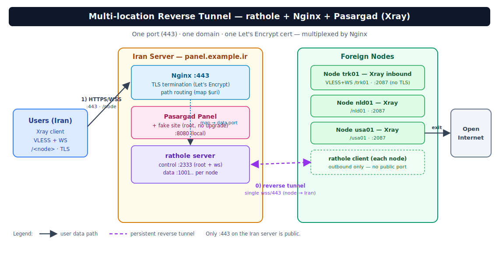

<div align="center">


# RatholeEngine

**سیستم تونل معکوس چند-موقعیتی روی rathole + Nginx**

_یک پورت (۴۴۳) · یک دامنه · یک گواهی · مسیریابی نودها با path_
_ساخته‌شده برای تونل مقاومِ سانسور به داخل ایران._

[](https://github.com/loopy-iri/RatholeEngine/actions/workflows/ci.yml)
[](https://github.com/loopy-iri/RatholeEngine/releases/latest)
[](https://github.com/loopy-iri/RatholeEngine/stargazers)
<br/>


[**English**](../README.md) · [**فارسی**](#این-چیست) · [شروع سریع](#شروع-سریع) · [مستندات](../README.md#documentation)

</div>

<div dir="rtl">

## این چیست

مدیریت خودکار تونل ریورس مولتی‌لوکیشن با **rathole + Nginx** روی **یک پورت (۴۴۳) و یک دامنه و یک گواهی**.
ساخته‌شده برای سناریوی: پنل (ایران) = rathole **server** + nginx، و نودهای خارج = rathole **client**.
مسیریابی به نودها با **path** انجام می‌شود (دقیقاً مدل `map $uri $backend_port`).



*نمای کلی معماری — همه‌چیز روی یک پورت/دامنه پشت Nginx؛ نودهای خارج با تونل ریورس به سرور ایران وصل می‌شوند.*


```
کاربر ──TLS/443──► nginx (btli.ir)
                     ├── /            (بدون upgrade) → 8080  سایت فیک
                     ├── /  + ws      → 2333  کانال کنترلی rathole
                     ├── /sub/...     → 2096  ساب‌اسکریپشن
                     ├── /trk01       → 1001  دیتای نود trk01 ─┐
                     ├── /nld01       → 1002  دیتای نود nld01 ─┼─ تونل rathole ─► نودهای خارج
                     └── ...                                   ┘
```

## اجزاء

| فایل | محل اجرا | کار |
|------|----------|-----|
| `bootstrap.sh` | هر سرور | آماده‌سازی محیط + دانلود بسته از لینک + باز کردن + اجرای نصاب |
| `install-panel.sh` | سرور **ایران** | نصب rathole، jq، nginx، نصب `ratholectl`، systemd، init اولیه |
| `ratholectl` | سرور **ایران** | مدیریت نودها؛ تولید خودکار `server.toml` و کانفیگ nginx؛ reload |
| `install-node.sh` | هر **نود خارج** | نصب rathole، نوشتن `node.env`، نصب `ratholenode`، استارت |
| `ratholenode` | هر **نود خارج** | مدیریت کلاینت در طول زمان + بررسی تداخل پورت با nginx نود |
| `uninstall-panel.sh` | سرور **ایران** | حذف کامل + ری‌استور بکاپ کانفیگ nginx |
| `uninstall-node.sh` | هر **نود خارج** | حذف کامل کلاینت (بدون دست‌زدن به nginx/Xray نود) |

## مدیریت در طول زمان (CLI)

### روی سرور ایران — `ratholectl`

```bash
ratholectl ls                          # لیست نودها
ratholectl add <name> <inbound> [--api-port N]
ratholectl edit <name> --inbound 2088  # تغییر پورت اینباند نود
ratholectl edit <name> --api-port 62050 # روشن‌کردن کانال مدیریت
ratholectl edit <name> --api-port off   # خاموش‌کردن کانال مدیریت
ratholectl rename <old> <new>          # تغییر نام/مسیر نود
ratholectl rotate <name>               # چرخش توکن(ها)
ratholectl show <name>                 # جزئیات + دستور نصب
ratholectl set domain <new>            # تغییر تنظیمات سراسری
ratholectl set fake-port 8443          # ... fake-port/sub-port/control-port/nginx-conf/fullchain/key
ratholectl rm <name>                   # حذف نود
ratholectl doctor                      # بررسی سلامت
ratholectl update                      # به‌روزرسانی کامل از GitHub (آخرین Release؛ snapshot + rollback خودکار)
ratholectl menu                        # منوی تعاملی کامل
```

هر تغییر، کانفیگ‌ها را بازتولید و سرویس‌ها را reload می‌کند.

### سرویس game (SNI روی ۴۴۳ + TLS روی نود + گواهی واقعی)

برای یک سرویس امن‌تر/سبک‌تر کنار سیستم فعلی (مثلاً برای گیم) که با **SNI روی همان ۴۴۳** کار می‌کند و TLS را روی **نود** ترمینیت می‌کند (VLESS+TLS+Vision با گواهی واقعی):

```bash
# روی پنل ایران:
ratholectl game add gamenode 8444 game.l1t.ir   # نام، پورت اینباند TLS نود، ساب‌دامین(SNI)
ratholectl game cert game.l1t.ir                # گرفتن گواهی + دستور/محتوای انتقال به نود
ratholectl game ls
ratholectl game rm gamenode
```
با اولین `game add`، پورت ۴۴۳ به حالت **stream/SNI** می‌رود و L7 فعلی (path/WS) روی پورت داخلی (۸۴۴۳) منتقل می‌شود — کاربران path هیچ تغییری نمی‌بینند. ترافیک `game.l1t.ir` به‌صورت L4 passthrough به نود می‌رود.

روی **نود**:
```bash
ratholenode add-svc gamenode <token> 8444    # توکن از خروجی game add
ratholenode fakeweb start 8081               # وب فیک سبک برای fallback
# سپس اینباند Xray = VLESS+TLS+Vision با گواهی /etc/xray-certs/game.l1t.ir/ و fallback→8081
```

> این حالت SNI↔IP منسجم دارد (game.l1t.ir → IP ایران)، گواهی واقعی، روی ۴۴۳، و سبک (L4). در برابر passive DPI منسجم‌تر از Reality با SNI قرضی است.

### روی هر نود خارج — `ratholenode`

```bash
ratholenode show                       # تنظیمات و سرویس‌های فعلی
ratholenode ls                         # لیست سرویس‌های روی این تونل
ratholenode add-svc <name> <token> <inbound>   # افزودن سرویس به همان تونل (توکن از 'ratholectl add' پنل)
ratholenode rm-svc <name>              # حذف سرویس
ratholenode set SERVER newdomain:443   # تغییر سرور
ratholenode check                      # بررسی تداخل پورت با nginx نود
ratholenode update                     # به‌روزرسانی کامل از GitHub (آخرین Release؛ snapshot + rollback خودکار)
ratholenode status | logs | apply
```

#### چند IP خروجی روی یک تونل (multi-egress)
اگر نود چند IP خروجی دارد و می‌خواهی همه روی **یک تونل** باشند:

1. روی **پنل** برای هر IP یک سرویس بساز:
   ```bash
   ratholectl add trk01-ip1 2087
   ratholectl add trk01-ip2 2088
   ratholectl add trk01-ip3 2089
   ```
2. روی **نود**، هر سرویس را با توکنش به همان تونل اضافه کن:
   ```bash
   ratholenode add-svc trk01-ip1 <token1> 2087
   ratholenode add-svc trk01-ip2 <token2> 2088
   ratholenode add-svc trk01-ip3 <token3> 2089
   ```
   همه زیر یک `[client]` → **یک کانال کنترلی (یک تونل)**.
3. در **Xray نود**، هر اینباند (path مربوطه) را به یک outbound با `sendThrough=IP` متفاوت route کن (انتخاب IP خروجی کارِ Xray است، نه rathole).

> **عدم تداخل با nginx روی نود:** کلاینت rathole **هیچ پورت عمومی‌ای bind نمی‌کند** (فقط اتصال خروجی)، پس با nginx روی نود تداخل ندارد. تنها قید: پورت اینباند Xray باید روی `127.0.0.1` و **غیر از 80/443** باشد. `ratholenode` این را هنگام `apply`/`check` بررسی می‌کند.

## پرفورمنس و استیبل‌سازی (لگ ریلز / مسیر lossy)

اگر مسیر ایران↔نود **پکت‌لاس** دارد (در iperf3 چیزی مثل ۹٪ UDP loss یا Retr بالای TCP)، علت لگ ریلز همین است: TCP داخل تونل، loss را با ارسال مجدد جبران می‌کند و throughput نوسانی/کند می‌شود (مشکل TCP-over-TCP). دو ابزار اضافه شده:

### ۱) `tune` — BBR و لیمیت‌های سیستم/nginx (بدون ری‌استارت سرور)
```bash
ratholectl tune      # روی ایران
ratholenode tune     # روی نود
```
BBR + fq + افزایش file/conntrack/backlog + worker_connections nginx. برست‌های ۵۰۲ زیر بار را هم کم می‌کند. فقط `sysctl --system` + `nginx reload` می‌زند (نه ریبوت، نه قطع تونل).

### ۲) `kcp` — تونل UDP+FEC موازی (A/B، بدون خرابکاری در سیستم فعلی)
kcptun یک تونل **UDP با FEC** می‌سازد که پکت‌های گم‌شده را بازسازی می‌کند، پس TCP داخلی یک مسیر تمیز می‌بیند. این حالت **افزودنی** است: rathole-server و nginx و ۴۴۳ دست‌نخورده می‌مانند؛ فقط یک مسیر ورودی دوم (UDP) ساخته می‌شود و نود می‌تواند بین دو مسیر سوییچ کند.

```bash
# روی ایران: مسیر UDP+FEC را روشن کن (پیش‌فرض پورت 443 = استتار شبیه QUIC، پروفایل balanced)
ratholectl kcp on                    # = kcp on 443 balanced
ratholectl kcp on 443 lossy          # loss زیاد روی مسیر → parity بیشتر
ratholectl kcp on 443 aggressive     # کم‌ترین لتنسی (mode fast3، پنجره بزرگ)
#  → کلید و دستور دقیق نود (با پروفایل) را چاپ می‌کند. پورت UDP را در فایروال باز کن:
#     ufw allow 443/udp     (یا Security Group ابری)   ← با nginx روی TCP/443 تداخل ندارد
ratholectl kcp status        # وضعیت + پروفایل + استتار
ratholectl kcp show          # دوباره چاپ دستور نود
ratholectl kcp off           # خاموش‌کردن مسیر UDP (برگشت کامل)

# روی نود: تونل را به مسیر kcp سوییچ کن (ip:port و کلید و پروفایل از خروجی بالا)
ratholenode kcp on <IRAN_IP>:443 <KEY> balanced
ratholenode kcp status
ratholenode kcp off          # برگشت فوری به websocket/443
```
سوییچ kcp **سرویس‌ها/توکن‌ها/path کاربران را تغییر نمی‌دهد** — کاربران لازم نیست ساب را آپدیت کنند؛ فقط مسیر حملِ همان تونل عوض می‌شود. اگر بهتر بود نگهش دار، اگر نه `kcp off` بزن.

> پروفایل‌ها (باید روی هر دو سر یکی باشند): `balanced` (10/3, fast2) ، `lossy` (10/5, fast2) ، `aggressive` (10/4, fast3, پنجره 4096).
> استتار: پورت **UDP/443** برای DPI شبیه QUIC/HTTP3 است. برای استتار قوی‌تر (udp2raw/obfs) به [`performance.md`](performance.md) نگاه کن.
> برای **سنجش قبل از سوییچ** هم اسکریپت‌های `kcptest-iran.sh` / `kcptest-node.sh` هستند که با iperf3 مسیر FEC را با مسیر مستقیم مقایسه می‌کنند.

#### kcp برای چند سرور ایران (multi-Iran) + مهاجرت
اگر نود به چند سرور ایران وصل است (یک `main` + چند `upstream`)، هر کدام می‌توانند **مستقل** kcp شوند. هر سرور ایران `ratholectl kcp on 443 <profile>` خودش را می‌زند؛ روی نود:
```bash
ratholenode migrate          # نقشه‌ی مهاجرت همه تونل‌ها + دستور دقیق هرکدام را چاپ می‌کند
# تونل اصلی:
ratholenode kcp on <IRAN1_IP>:443 <KEY1> balanced
# هر سرور ایران دوم/سوم (upstream) جداگانه:
ratholenode upstream kcp <id> on <IRAN2_IP>:443 <KEY2> balanced
ratholenode upstream kcp <id> status
ratholenode upstream kcp <id> off          # فقط همان upstream را برمی‌گرداند
```
هر تونل kcp-client جداگانه با پورت لوکال متفاوت (main=29900 ، upstreamها از 29901) و سرویس systemd مستقل (`rathole-kcp-up-<id>`) دارد؛ پس روی هم اثر نمی‌گذارند و هرکدام مستقل قابل خاموش/روشن‌اند.

### ۲.۵) `noise` — تونل رمزنگاری‌شده بدون TLS/گواهی (جایگزین سبک TLS)
اگر می‌خواهی خودِ تونل **رمزنگاری‌شده** باشد ولی سربار و گواهیِ TLS را نداشته باشی، حالت `noise` از ترنسپورت داخلی **Noise** در rathole استفاده می‌کند (همان رمزنگاری WireGuard: X25519 + ChaChaPoly). سرور یک‌بار **جفت‌کلید** می‌سازد؛ نود فقط **کلید عمومی** را می‌گیرد (مثل مدل کلید kcp) — نیازی به cert نیست.

برخلاف `plain` (که هنوز در سطح rathole وب‌سوکت است و فقط TLS نگینکس را برمی‌دارد)، `noise` یک **ترنسپورت کاملاً متفاوت** است و از nginx رد نمی‌شود. برای همین روی یک **اینستنس دوم rathole** (`rathole-noise`) روی یک **پورت TCP عمومی جدا** اجرا می‌شود و انتخاب per-node است: هر نود یا روی noise می‌رود یا روی ws/443 می‌ماند (سرویس هر نود دقیقاً در یکی از `server.toml` یا `noise-server.toml` می‌رود — چون دو پروسه نمی‌توانند یک `bind_addr` را share کنند).

```bash
# روی ایران: اینستنس noise را روی یک پورت عمومی روشن کن (پیش‌فرض 2334؛ 443 و internal_port رد می‌شوند)
ratholectl noise on                  # = noise on 2334 ؛ جفت‌کلید را می‌سازد و دستور نود را چاپ می‌کند
#  → پورت TCP را در فایروال باز کن:   ufw allow 2334/tcp   (خودکار هم تلاش می‌شود)
ratholectl noise node <name> on      # این نود را به مسیر noise ببر (سرویسش به noise-server.toml می‌رود)
ratholectl noise node <name> off     # این نود را به ws/443 برگردان
ratholectl noise status              # روشن/خاموش + پورت + تعداد نودهای noise
ratholectl noise show                # دوباره چاپ دستور نود (کلید عمومی + پورت)
ratholectl noise off                 # خاموشیِ کامل: همه نودها به ws برمی‌گردند، سرویس/toml/unit حذف می‌شود

# روی نود: تونل را به مسیر noise سوییچ کن (ip:port و کلید عمومی از خروجی بالا)
ratholenode noise on <IRAN_IP>:2334 <PUBKEY> [<pattern>]
ratholenode noise status
ratholenode noise off                # برگشت فوری به websocket/443 (با TLS)
```
سوییچ noise هم **سرویس‌ها/توکن‌ها/path کاربران را تغییر نمی‌دهد** — فقط مسیر حملِ تونل رمزنگاری‌شده می‌شود.

> کلید عمومی قابل انتشار است؛ کلید خصوصی فقط روی ایران می‌ماند. پترن پیش‌فرض `Noise_NK_25519_ChaChaPoly_BLAKE2s` است (فقط سرور کلید استاتیک دارد). پورت noise **عمومی** است و باید در فایروال باز باشد؛ با ۴۴۳/game تداخل ندارد (رد می‌شود). در پنل وب هم دکمه‌های noise با **پرکردن خودکار کلید** از سرور ایران موجود است.

### ۳) توصیه‌های کلاینت/نود
- روی کانفیگ کلاینت‌ها برای استریم/لتنسی **`mux=off`** بگذار (mux برای ریلز ضرر دارد).
- اگر `kcp` هم لگ را حل نکرد، احتمالاً **IP نود** کثیف/throttle است؛ نود تمیزتر را امتحان کن.

## نکات کلیدی فنی

- کانال کنترلی rathole همیشه روی مسیر `/` با هدر WebSocket Upgrade وصل می‌شود (path در rathole قابل تنظیم نیست). به همین دلیل nginx ریشه را با `$http_upgrade` بین «سایت فیک» و «کانال کنترل» تفکیک می‌کند.
- TLS را فقط **nginx** ترمینیت می‌کند؛ ترنسپورت rathole روی سرور `websocket` با `tls=false` و روی کلاینت `websocket` با `tls=true` است. (استثنا: حالت `noise` یک اینستنس دوم rathole با ترنسپورت `noise` روی پورت عمومی است که خودش رمزنگاری می‌کند و از nginx رد نمی‌شود.)
- هر نود یک سرویس **دیتا** دارد؛ و اگر `--api-port` بدهی یک سرویس **مدیریت** (`_api`) هم برای ارتباط پنل↔نود ساخته می‌شود که روی `127.0.0.1` ظاهر می‌گردد.
- **path در سه جا باید یکی باشد:** کانفیگ کاربر = `map` در nginx = اینباند Xray روی نود. نام نود = همان path.

## شروع سریع

> می‌خواهی **دستی و گام‌به‌گام** نصب کنی (پنل ایران + کانفیگ پاسارگارد + نودها + هاب)؟ راهنمای کامل: [`install-manual.fa.md`](install-manual.fa.md).

### نصب تک‌کامانده از گیت‌هاب (curl | sudo bash)

ساده‌ترین راه؛ آخرین بسته‌ی release را از گیت‌هاب می‌گیرد و نصاب را اجرا می‌کند. پیش‌فرض روی `loopy-iri/RatholeEngine` است — برای fork خودت متغیر `RATHOLE_GH` را ست کن:

```bash
# کاملاً تعاملی (حالت پنل/نود و اطلاعات را می‌پرسد)
curl -fsSL https://raw.githubusercontent.com/loopy-iri/RatholeEngine/main/install.sh | sudo bash

# سرور ایران (پنل) غیرتعاملی:
curl -fsSL https://raw.githubusercontent.com/loopy-iri/RatholeEngine/main/install.sh | sudo bash -s -- --panel \
  --domain panel.example.ir \
  --fullchain /root/cert/panel.example.ir/fullchain.pem \
  --key       /root/cert/panel.example.ir/privkey.pem

# نود خارج غیرتعاملی:
curl -fsSL https://raw.githubusercontent.com/loopy-iri/RatholeEngine/main/install.sh | sudo bash -s -- --node -- \
  --server panel.example.ir:443 --name trk01 --token <T> --inbound-port 2087

# آپدیت کامل (تشخیص خودکار پنل/نود/هاب، با snapshot + رولبک خودکار):
curl -fsSL https://raw.githubusercontent.com/loopy-iri/RatholeEngine/main/install.sh | sudo bash -s -- --update
```

> `install.sh` فایل‌های `rathole-manager.zip` و `bootstrap.sh` را از آخرین GitHub Release (که workflowِ release می‌سازد) دانلود می‌کند و بعد به `bootstrap.sh` تحویل می‌دهد. برای تغییر مخزن: `RATHOLE_GH="you/repo"` و برای پین‌کردن نسخه: `RATHOLE_RELEASE="v1.2.3"`.
>
> **در ایران (فیلترینگ گیت‌هاب):** اگر دانلود مستقیم گیت‌هاب کار نکرد، بسته را روی سرور خارج بگیر و از روش «بسته‌ی محلی» زیر (`bootstrap.sh --local`) استفاده کن.

### آپدیت و رولبک

`update.sh` قبل از هر تغییر یک **snapshot کامل** (CLI + کانفیگ‌ها + یونیت‌های systemd) در `/var/backups/rathole-manager/` می‌گیرد، بعد از آپدیت **health-check** می‌زند (سرویس بالا آمد؟ `nginx -t` سالم؟) و اگر خراب بود **خودکار به snapshot برمی‌گردد**.

> **ساده‌ترین راه از خودِ سرور:** `sudo ratholectl update` (روی ایران) یا `sudo ratholenode update` (روی نود) — `install.sh` آخرین Release را از GitHub (با mirrorهای ghproxy برای دور زدن فیلترینگ) می‌گیرد و همین `update.sh` را با snapshot + rollback اجرا می‌کند. در **هاب** هم دکمه‌ی «آپدیت» هر سرور دقیقاً همین کار را از راه دور انجام می‌دهد (دیگر به bundle محلی هاب وابسته نیست).

```bash
sudo ratholectl update                  # روی ایران: آپدیت کامل از GitHub (آخرین Release)
sudo ratholenode update                 # روی نود:  آپدیت کامل از GitHub (آخرین Release)
sudo bash update.sh                     # آپدیت با snapshot + health-check + رولبک خودکار
sudo bash update.sh --list-backups      # لیست snapshotها
sudo bash update.sh --rollback          # بازگشت به آخرین snapshot
sudo bash update.sh --rollback 20260713-2210   # بازگشت به snapshot مشخص
sudo bash update.sh --no-rollback       # آپدیت بدون بازگشت خودکار (فقط snapshot بگیر)
```

آخرین ۷ snapshot نگه داشته می‌شوند (با `RATHOLE_BACKUP_RETENTION` قابل تغییر). رولبک از هر مسیر دیگری هم قابل‌فراخوانی است: `sudo bash bootstrap.sh --rollback` یا `--list-backups`.

### نصب تک‌خطی با bootstrap (دانلود + باز کردن + نصب)

`bootstrap.sh` بیرون از بسته قرار دارد. اگر بسته (`rathole-manager.zip` یا `.tar.gz`) **کنار اسکریپت یا در مسیر جاری باشد، دانلود نمی‌کند** و از همان استفاده می‌کند. اگر اطلاعات کافی ندهی، **به‌صورت تعاملی می‌پرسد**.

```bash
# کاملاً تعاملی: حالت (پنل/نود) و اطلاعات را می‌پرسد، و اگر زیپ کنارش باشد دانلود نمی‌کند
sudo bash bootstrap.sh

# با بسته‌ی محلی صریح (بدون دانلود):
sudo bash bootstrap.sh --local ./rathole-manager.zip

# سرور ایران (پنل) غیرتعاملی:
sudo bash bootstrap.sh --url https://YOUR_LINK/rathole-manager.zip --panel \
  --domain panel.example.ir \
  --fullchain /root/cert/panel.example.ir/fullchain.pem \
  --key       /root/cert/panel.example.ir/privkey.pem

# نود خارج غیرتعاملی:
sudo bash bootstrap.sh --url https://YOUR_LINK/rathole-manager.zip --node -- \
  --server panel.example.ir:443 --name trk01 --token <T> --inbound-port 2087

# فقط آماده‌سازی و باز کردن (بدون اجرای نصاب):
sudo bash bootstrap.sh --local ./rathole-manager.zip --no-run
```

`bootstrap.sh` خودش:
- پکیج‌منیجر را تشخیص می‌دهد (apt/dnf/yum/pacman/apk) و `curl unzip tar ca-certificates` را نصب می‌کند
- **منبع بسته را تعیین می‌کند:** `--local` → سپس `--url` (اگر file:// یا مسیر محلی باشد کپی، وگرنه دانلود) → سپس **جستجوی خودکار بسته‌ی محلی** (بدون دانلود) → در نهایت پرسش تعاملی URL/مسیر
- بسته را (zip یا tar.gz) باز می‌کند، در `/opt/rathole-manager` می‌گذارد، خط‌پایان‌ها را LF و اسکریپت‌ها را قابل‌اجرا می‌کند
- اگر حالت مشخص نباشد، **منوی انتخاب پنل/نود/فقط‌آماده‌سازی** را نشان می‌دهد؛ برای نود اطلاعات (server/name/token/inbound/api) را می‌پرسد؛ برای پنل، `install-panel.sh` خودش به‌صورت تعاملی می‌پرسد

> فلگ‌ها: `--url`, `--local`, `--dir`, `--panel`, `--node`, `--no-run`, `--yes`. هر آرگومانی بعد از `--` (یا ناشناخته) به نصاب پاس داده می‌شود.

### نصب دستی (اگر فایل‌ها را از قبل داری)

روی سرور ایران، فقط همین یک اسکریپت همه‌چیز را خودکار انجام می‌دهد:

```bash
sudo bash install-panel.sh
```

### حالت فلگ‌محور (وقتی دامنه/گواهی/پورت‌هایت فرق دارد و گواهی از قبل داری)

می‌توانی همه مقادیر را مستقیم بدهی تا بدون پرسش و **بدون certbot** اجرا شود.
مهم‌تر از همه: با `--nginx-conf` می‌توانی **فایل کانفیگ nginx فعلی‌ات را مستقیماً ریپلیس کنی** (از فایل قبلی یک `.rathole-orig.bak` گرفته می‌شود):

```bash
sudo bash install-panel.sh \
  --domain example.ir \
  --fullchain /root/cert/example.ir/fullchain.pem \
  --key       /root/cert/example.ir/privkey.pem \
  --nginx-conf /etc/nginx/sites-available/example.ir.conf \
  --fake-port 8080 --sub-port 2096 --control-port 2333
```

فلگ‌های `ratholectl init`:

| فلگ | پیش‌فرض | توضیح |
|-----|---------|-------|
| `--domain` | (الزامی) | دامنه |
| `--fullchain` | `/root/cert/<domain>/fullchain.pem` | گواهی موجود |
| `--key` | `/root/cert/<domain>/privkey.pem` | کلید موجود |
| `--nginx-conf` | `/etc/nginx/conf.d/rathole.conf` | فایلی که تولید/ریپلیس می‌شود |
| `--fake-port` | `8080` | سایت فیک/پنل پاسارگارد |
| `--sub-port` | `2096` | ساب‌اسکریپشن |
| `--control-port` | `2333` | کنترل لوکال rathole |
| `--data-start` | `1001` | شروع پورت دیتای نودها |
| `--api-start` | `7001` | شروع پورت مدیریت نودها |
| `--certbot` | (خاموش) | فقط اگر بدهی، گواهی با certbot گرفته می‌شود |

> گواهی **هیچ‌وقت تحمیل نمی‌شود**؛ اگر مسیر گواهی موجود باشد همان استفاده می‌شود. certbot فقط با `--certbot` یا در حالت تعاملی با تأیید تو اجرا می‌شود.

> هر چیزی که در فایل nginx هدف باشد ریپلیس می‌شود، ولی سایت فیک/پنل پاسارگاردت باید روی پورت لوکال (`--fake-port`) سرو شود؛ کانفیگ تولیدی default را به همان پورت می‌فرستد.

سپس افزودن نود:

```bash
sudo ratholectl add trk01 2087        # نام=trk01 ، پورت اینباند Xray روی نود=2087
sudo ratholectl add usa01 2087 --api-port 62050   # با کانال مدیریت پنل↔نود
```

دستور بالا توکن و «دستور نصب نود» چاپ می‌کند. آن را روی نود خارج اجرا کن:

```bash
sudo bash install-node.sh --server example.ir:443 --name trk01 \
     --token <TOKEN> --inbound-port 2087
```

بررسی سلامت کل سیستم در هر زمان:

```bash
sudo ratholectl doctor
```

سپس روی نود، در پنل/Xray یک اینباند **VLESS + WS (یا HTTPUpgrade)** با `path=/trk01`، `listen=127.0.0.1`، `port=2087`، **TLS خاموش** بساز.
کانفیگ کاربر: `address=example.ir`، `port=443`، `ws`، `path=/trk01`، `TLS=on`.

جزئیات کامل و عیب‌یابی در `rathole-multilocation-pasargad.md`.

## حذف (Uninstall)

روی سرور ایران:

```bash
sudo bash uninstall-panel.sh          # سرویس/کانفیگ/state را حذف و بکاپ nginx را ری‌استور می‌کند
sudo bash uninstall-panel.sh --purge --yes   # باینری rathole هم حذف، بدون پرسش
```

روی هر نود خارج:

```bash
sudo bash uninstall-node.sh           # کلاینت rathole را حذف می‌کند (به nginx/Xray نود دست نمی‌زند)
sudo bash uninstall-node.sh --purge --yes
```

> `uninstall-panel.sh` اگر فایل `*.rathole-orig.bak` وجود داشته باشد، کانفیگ nginx اصلی‌ات را **برمی‌گرداند**. بکاپ‌های پوشه‌ای تداخل (`/etc/nginx/rathole-backup-*`) دست‌نخورده می‌مانند تا در صورت نیاز دستی برگردانی. گواهی Let's Encrypt هم عمداً حذف نمی‌شود.

</div>
