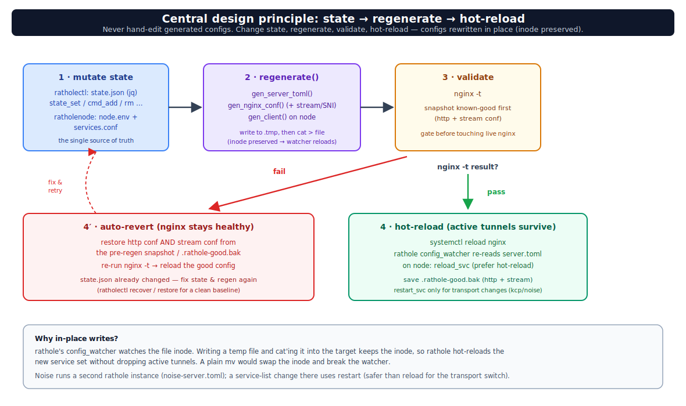

# معماری — سه نقش و اصل مرکزی طراحی

`rathole-manager` یک سیستم تونل معکوس چند-موقعیتی بر پایه‌ی **rathole + Nginx** است. یک سرور ایران (پشت یک دامنه، یک گواهی، یک پورت ۴۴۳) جلوی چند «نود» خارجی قرار می‌گیرد که با تونل معکوس به آن وصل می‌شوند. ترافیک کاربر با **path** به نودها مسیریابی می‌شود (`map $uri $backend_port` در nginx).

*همه‌چیز روی یک پورت/دامنه پشت Nginx؛ نودهای خارج با تونل معکوس به سرور ایران وصل می‌شوند.*

## سه نقش، سه برنامه

| نقش | برنامه | کار |
|-----|--------|-----|
| **پنل ایران** | [`ratholectl`](../rathole-manager/ratholectl) (bash) | rathole **server** + nginx. مالک inventory نودها. `server.toml` و `rathole.conf` را تولید می‌کند. |
| **نود خارج** | [`ratholenode`](../rathole-manager/ratholenode) (bash) | rathole **client**. `client.toml` را تولید می‌کند. |
| **هاب** | [`ratholehub/hub.py`](../rathole-manager/ratholehub/hub.py) (Python، فقط stdlib) | پنل وب مرکزی که چند سرور ایران/نود را از طریق SSH مدیریت می‌کند. جزئیات: [`hub.md`](hub.md). |

`common.sh` توسط هر دو ابزار bash سورس می‌شود (رنگ/لاگ، `kcp_profile`، `install_kcptun`، `apply_sysctl_tuning`، `fakeweb_service`).

## اصل مرکزی: state → regenerate → hot-reload

هر تغییری همین الگو را دارد — **هیچ‌وقت کانفیگ‌های تولیدشده را دستی ویرایش نکن**؛ state را عوض کن و بازتولید کن:

- **ratholectl**: state در `/etc/rathole-manager/state.json` (با jq). دستورها state را تغییر می‌دهند، سپس `regenerate()` → `gen_server_toml()` + `gen_nginx_conf()` → `nginx -t` → reload. کانفیگ‌ها **در جای خود** (با حفظ inode) نوشته می‌شوند تا `config_watcher` در rathole بدون قطع تونل‌های فعال hot-reload کند. اگر `nginx -t` شکست بخورد، به `.rathole-good.bak` برمی‌گردد.
- **ratholenode**: state در `/etc/rathole/node.env` + `/etc/rathole/services.conf`. `gen_client()` فایل `client.toml` را می‌سازد؛ `reload_svc` hot-reload را به restart ترجیح می‌دهد (restart فقط برای تغییر transport مثل روشن/خاموش‌کردن kcp).

## path == نام نود == نگاشت nginx == inbound Xray

نام یک نود هم‌زمان مسیر URL آن، ورودی `map` در nginx، و path اینباند Xray روی نود است. این سه باید یکسان بمانند. هر نود یک سرویس داده دارد؛ افزودن `--api-port` یک سرویس `<name>_api` هم می‌سازد (bind روی `127.0.0.1`) برای مدیریت پنل↔نود از طریق تونل.

## حالت‌های transport

همان تونل می‌تواند ترافیک را چهار جور حمل کند (websocket+TLS پیش‌فرض، kcp، plain، noise) به‌علاوه‌ی حالت game/SNI. جزئیات کامل: [`transport-modes.md`](transport-modes.md).

## مستندات مرتبط

- [`traffic-flow.md`](traffic-flow.md) — مسیر بسته لایه‌به‌لایه.
- [`performance.md`](performance.md) — تیونینگ فراتر از تونل (BBR، kcp، گلوگاه‌های غیرتونل).
- [`README.fa.md`](README.fa.md) — مرجع کامل CLI و روش‌های نصب.
- [`../rathole-multilocation-pasargad.md`](../rathole-multilocation-pasargad.md) — سند طراحی/عیب‌یابی تفصیلی اصلی.
