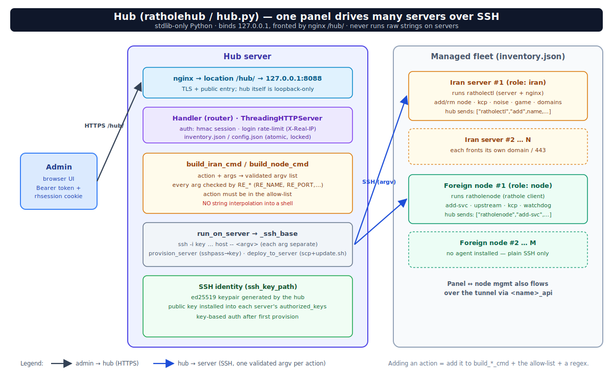

# ratholehub — پنل وب مدیریت (REST API + UI)

پنل مرکزی برای مدیریت ویژوال چند سرور ایران و چند نود، بدون تداخل با سیستم فعلی.



*هاب روی `127.0.0.1` پشت nginx `/hub/` می‌شنود و با SSH (کلید) روی هر سرور، `ratholectl`/`ratholenode` را با یک **argv اعتبارسنجی‌شده** اجرا می‌کند — هرگز رشته‌ی شل خام.*

## چرا این طراحی
- **بدون agent روی نودها**: پنل فقط روی یک سرور (معمولاً rp01) نصب می‌شود و از طریق **SSH با کلید** همان `ratholectl`/`ratholenode` تست‌شده را روی بقیه اجرا می‌کند. هیچ پورت/سرویس جدیدی روی نودها باز نمی‌شود.
- **بدون وابستگی pip**: فقط پایتون stdlib. با هیچ‌چیز روی سرور تداخل نمی‌کند.
- **REST API توکن‌دار**: برای اتصال ابزارهای دیگر/اتوماسیون و کنترل وضعیت.
- **امن**: روی `127.0.0.1` می‌شنود؛ دسترسی از طریق SSH-forward یا nginx زیر همان دامنه (یک پورت/یک دامنه حفظ می‌شود). جزئیات در [مدل امنیتی](#مدل-امنیتی).

## نصب
```bash
cd rathole-manager/ratholehub
sudo bash install-hub.sh          # رمز مدیریت می‌پرسد، API TOKEN تولید می‌کند
```

### افزودن سرورها — دو راه

**راه ساده (پیشنهادی): دکمه‌ی «نصب خودکار» (provision) در داشبورد** — یا `POST /api/provision`. یک‌بار با **رمز SSH** به سرور وصل می‌شود (نیازمند `sshpass` روی هاب)، کلید عمومی هاب را به `authorized_keys` اضافه می‌کند (idempotent)، همان‌جا deploy از GitHub را اجرا و سرور را در inventory ثبت می‌کند. کلید هاب از config (`ssh_key_path`؛ نصاب `/root/.ssh/id_ed25519` می‌سازد) می‌آید و اگر خالی باشد هاب خودش `/etc/ratholehub/id_ed25519` تولید می‌کند.

**راه دستی:** خودت کلید را ست کن:
```bash
ssh-copy-id -i /root/.ssh/id_ed25519.pub root@<node_ip>
ssh-copy-id -i /root/.ssh/id_ed25519.pub root@<iran2_ip>
```

## دسترسی
امن‌ترین (بدون باز کردن پورت) — از سیستم خودت:
```bash
ssh -L 8088:127.0.0.1:8088 root@<rp01_ip>
# مرورگر:  http://localhost:8088
```
یا پشت nginx زیر همان دامنه: `sudo ratholectl hub on 8088` → `https://<domain>/hub/`. (بار اول اگر هاب نصب نباشد خودش `install-hub.sh` را اجرا می‌کند؛ دفعات بعد پورت واقعی هاب را عوض و سرویس را ری‌استارت می‌کند.)

## رابط کاربری (UI)

UI تک‌فایل داخل `hub.py` است: **sidebar + hash-router** (پس زیر `/hub/` هم کار می‌کند)، دوزبانه‌ی **فارسی/انگلیسی**، ریسپانسیو، با رفرش خودکار هوشمند (هر ۲۰ ثانیه فقط داده‌ی صفحه‌ی فعال؛ قابل خاموش‌کردن).

| صفحه | محتوا |
|------|-------|
| **داشبورد** (`#/dashboard`) | کارت ه