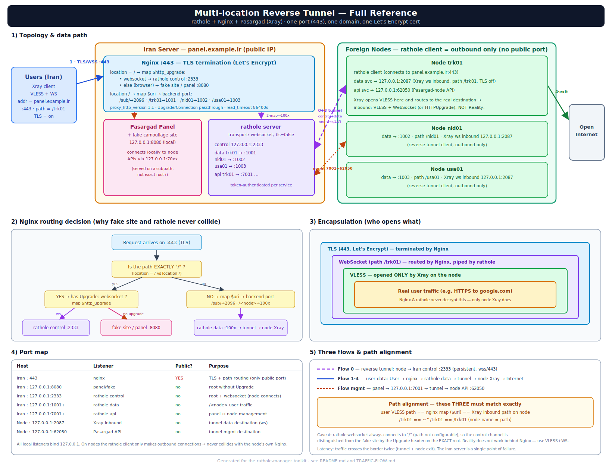
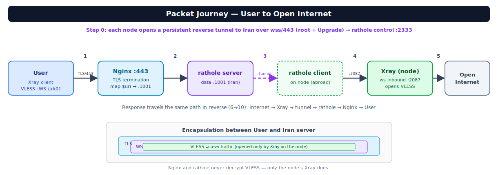
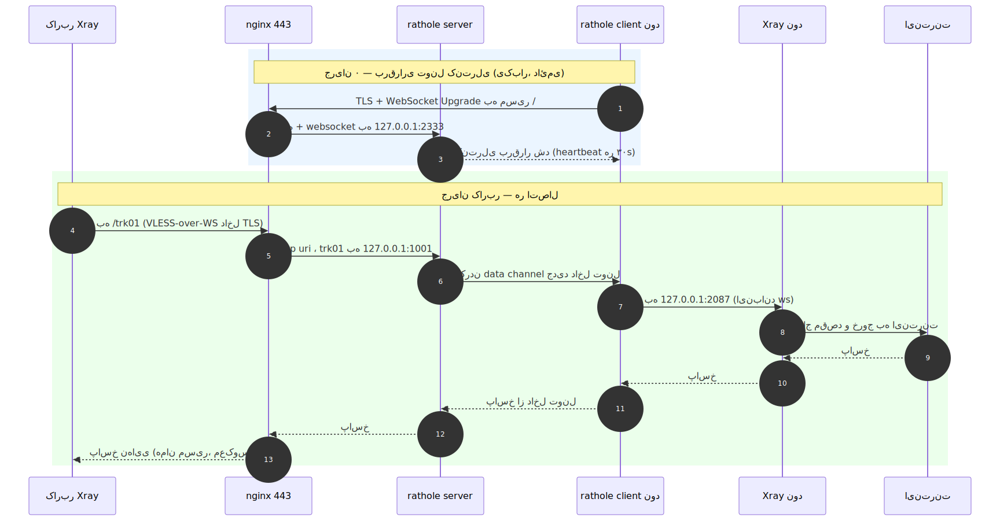
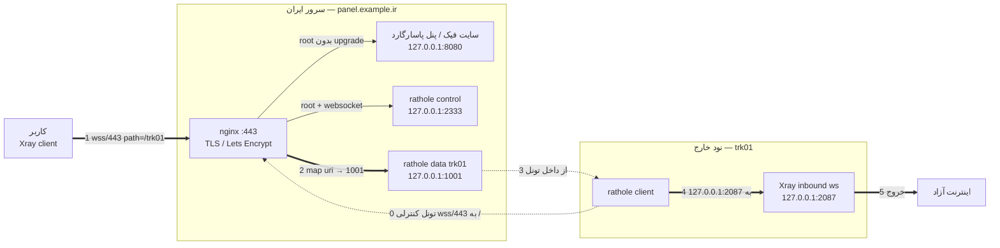
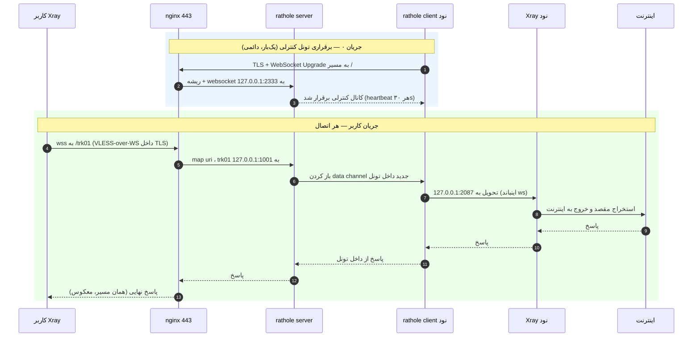

# مسیر دقیق ترافیک — تونل ریورس مولتی‌لوکیشن (پاسارگارد + rathole + Nginx)

این سند دقیقاً نشان می‌دهد یک بسته از لحظه‌ای که کاربر دکمه «اتصال» را می‌زند تا
رسیدن به اینترنت آزاد، از چه لایه‌هایی عبور می‌کند و هر جزء چه‌کار می‌کند.

> فرض‌ها برای مثال: دامنه `panel.example.ir`، نود `trk01`، پورت اینباند Xray روی نود `2087`،
> پورت دیتای لوکال rathole روی سرور ایران `1001`، پورت کنترلی `2333`، سایت فیک/پنل `8080`.

---

## نمای کلی اجزاء

```
┌─────────┐        ┌──────────────── سرور ایران (panel.example.ir) ────────────────┐        ┌──── نود خارج (trk01) ────┐
│ کاربر   │        │                                                                │        │                          │
│ (Xray   │        │  nginx :443 (TLS / Let's Encrypt)                              │        │  rathole client          │
│ client) │        │    map $uri        → پورت لوکال                                │        │  Xray inbound (ws, no TLS)│
└────┬────┘        │    map $http_upgrade (ریشه: فیک یا کنترل)                       │        │  → خروج به اینترنت        │
     │             │                                                                │        └────────────┬─────────────┘
     │ (1) wss/443 │  rathole server (control :2333, data :1001, ...)               │                     │
     └────────────►│  پنل پاسارگارد + سایت فیک (:8080)                               │◄────(0) تونل کنترلی──┘
                   └────────────────────────────────────────────────────────────────┘     (نود به ایران وصل می‌شود)
```

دو جریان کاملاً مجزا داریم که هر دو روی **پورت ۴۴۳** و **یک دامنه** مالتی‌پلکس می‌شوند:

- **جریان (0): برقراری تونل** — یک‌بار هنگام بالا آمدن نود، و دائمی باقی می‌ماند.
- **جریان کاربر (1→8): دیتای واقعی** — هر بار که کاربر وصل می‌شود، داخل همان تونل جریان می‌یابد.

---

## نمودار تصویری مسیر (Mermaid)

> این نمودارها روی GitHub و در VS Code با افزونه‌ی Mermaid به‌صورت گرافیکی رندر می‌شوند.
> نسخه‌ی **تصویری** (SVG) هم در پوشه‌ی `assets/` موجود است:
> - `architecture.svg` — نمای معماری کلی (مناسب ارائه)
> - `traffic-flow-flowchart.svg` و `traffic-flow-sequence.svg` — جزئیات دقیق مسیر

**نمای معماری:** 

**📋 مرجع کامل و دقیق — همه‌چیز یک‌جا:** 

> `architecture-detailed.svg` شامل: توپولوژی کامل + منطق تصمیم‌گیری Nginx + لایه‌های کپسوله‌سازی + جدول پورت‌ها + سه جریان + هم‌ترازی path و هشدارها.

**سفر بسته گام‌به‌گام:** 

**فلوچارت کلی:** 

**نمودار ترتیبی:** 

### فلوچارت کلی



### نمودار ترتیبی (Sequence)



---

## جریان ۰: برقراری تونل کنترلی (نود → ایران)

این قبل از هر ترافیک کاربری اتفاق می‌افتد و پایه‌ی همه‌چیز است.

```
نود خارج (rathole client)                         سرور ایران
─────────────────────────                         ──────────
1. اتصال TCP به panel.example.ir:443
2. TLS handshake  ───────────────────────────────► nginx گواهی Let's Encrypt را ارائه می‌دهد
3. درخواست WebSocket Upgrade به مسیر "/"
   (هدر: Upgrade: websocket, Host: panel.example.ir)
                          │
                          ▼
                   nginx: location = /  →  map $http_upgrade
                          │  چون Upgrade=websocket  →  $root_backend = 2333
                          ▼
4. nginx اتصال را به 127.0.0.1:2333 پراکسی می‌کند (rathole server)
5. rathole server توکن سرویس را اعتبارسنجی می‌کند (مثلاً node trk01)
6. کانال کنترلی برقرار و دائمی باقی می‌ماند (heartbeat هر ۳۰ ثانیه)
```

**نکته‌ی کلیدی تفکیک:** چون rathole همیشه روی مسیر `/` وصل می‌شود، nginx ریشه را با
هدر `Upgrade` جدا می‌کند: درخواست عادی مرورگر به `/` → سایت فیک/پنل (`8080`)،
درخواست websocket به `/` → کانال کنترلی rathole (`2333`).

از این لحظه، rathole روی این کانال «منتظر» می‌ماند تا سرور ایران بگوید
«یک کانکشن جدید برای سرویس trk01 آمد، یک data channel باز کن».

---

## جریان کاربر: گام‌به‌گام (۱ تا ۸)

کاربر در کلاینت Xray این کانفیگ را دارد:
`address=panel.example.ir`, `port=443`, `network=ws`, `path=/trk01`, `TLS=on`.

```
(1) کاربر → TLS/443 به panel.example.ir
     کلاینت Xray یک درخواست WebSocket به  wss://panel.example.ir/trk01  می‌زند
     (لایه بیرونی: VLESS-over-WS داخل TLS)
                          │
                          ▼
(2) nginx گواهی را ارائه و TLS را ترمینیت می‌کند
                          │
                          ▼
(3) nginx مسیریابی می‌کند:
     - چون مسیر "/trk01" است (نه دقیقاً "/")، به location /  می‌رود
     - map $uri $backend_port:  ~^/trk01  →  $backend_port = 1001
     - proxy_pass http://127.0.0.1:1001   (بدون اسلش انتهایی → path "/trk01" حفظ می‌شود)
     - هدرهای Upgrade/Connection برای WebSocket پاس داده می‌شوند
                          │
                          ▼
(4) پورت 1001 = سرویس دیتای rathole server برای trk01
     rathole این کانکشن را می‌گیرد و به نود trk01 سیگنال می‌دهد:
     «یک data channel جدید باز کن»
                          │
                          ▼  (از داخل همان تونل کنترلی جریان ۰)
(5) نود trk01 (rathole client) یک data channel باز می‌کند و آن را به
     local_addr خودش وصل می‌کند:  127.0.0.1:2087
                          │
                          ▼
(6) 127.0.0.1:2087 = اینباند ws ایکس‌ری روی نود (TLS خاموش)
     Xray بسته‌ی VLESS-over-WS را می‌بیند؛ path داخل درخواست هنوز "/trk01" است
     و با path اینباند Xray (که "/trk01" تنظیم شده) مطابقت دارد → پذیرفته می‌شود
                          │
                          ▼
(7) Xray محتوای VLESS را باز می‌کند و مقصد واقعی کاربر را استخراج می‌کند
     (مثلاً google.com:443)
                          │
                          ▼
(8) Xray از روی IP نود خارج به اینترنت آزاد می‌رود و پاسخ از همین مسیر برعکس برمی‌گردد
```

### مسیر برگشت (پاسخ)

دقیقاً همان مسیر، معکوس:
`اینترنت → Xray نود → data channel → تونل rathole → 127.0.0.1:1001 → nginx → TLS/443 → کاربر`

---

## لایه‌های کپسوله‌سازی (مهم برای فهم «چرا کار می‌کند»)

در نقطه‌ی اوج (بین کاربر و سرور ایران)، یک بسته این‌طور تو‌در‌تو است:

```
┌─────────────────────────────────────────────────────────────┐
│ TLS (443، گواهی Let's Encrypt، توسط nginx ترمینیت می‌شود)      │
│ ┌─────────────────────────────────────────────────────────┐ │
│ │ WebSocket (مسیر /trk01)                                  │ │
│ │ ┌─────────────────────────────────────────────────────┐ │ │
│ │ │ VLESS (پروتکل واقعی پراکسی، توسط Xray نود باز می‌شود)  │ │ │
│ │ │ ┌─────────────────────────────────────────────────┐ │ │ │
│ │ │ │ ترافیک واقعی کاربر (مثلاً HTTPS به google.com)    │ │ │ │
│ │ │ └─────────────────────────────────────────────────┘ │ │ │
│ │ └─────────────────────────────────────────────────────┘ │ │
│ └─────────────────────────────────────────────────────────┘ │
└─────────────────────────────────────────────────────────────┘
```

- **nginx** فقط لایه‌ی بیرونی TLS و WebSocket را می‌بیند و بر اساس `path` تصمیم می‌گیرد.
  محتوای VLESS را **نمی‌بیند و باز نمی‌کند** — فقط بایت‌ها را پاس می‌دهد.
- **rathole** هیچ لایه‌ای را باز نمی‌کند؛ یک لوله‌ی شفاف TCP است که بایت‌ها را از
  ایران به نود می‌برد و برمی‌گرداند.
- **Xray روی نود** تنها جایی است که VLESS واقعاً باز می‌شود و مقصد استخراج می‌گردد.

---

## کانال مدیریت پنل ↔ نود (جریان مدیریتی، جدا از دیتا)

اگر نود را با `--api-port` ساخته باشی، یک سرویس دوم هم در تونل وجود دارد:

```
پنل پاسارگارد (روی سرور ایران)
   │  به 127.0.0.1:7001 وصل می‌شود (نه به IP عمومی نود)
   ▼
rathole service "trk01_api" (bind 127.0.0.1:7001)
   │  از داخل همان تونل
   ▼
نود trk01: rathole client → 127.0.0.1:62050 (پورت API پاسارگارد‑نود)
```

یعنی پنل فکر می‌کند نود روی `127.0.0.1:7001` لوکال است، در حالی‌که در واقع
ترافیک مدیریتی هم از همان تونل ریورس به نود خارج می‌رسد. این کانال **هرگز** از
nginx عمومی عبور نمی‌کند و بیرون دیده نمی‌شود.

---

## نقشه‌ی پورت‌ها (چه چیزی کجا گوش می‌دهد)

| محل | پورت | شنونده | عمومی؟ | توضیح |
|-----|------|--------|--------|-------|
| سرور ایران | `443` | nginx | بله | تنها درگاه عمومی؛ TLS + مسیریابی path |
| سرور ایران | `127.0.0.1:8080` | پنل/سایت فیک | خیر | ریشه بدون upgrade به اینجا می‌رود |
| سرور ایران | `127.0.0.1:2333` | rathole (control) | خیر | ریشه + websocket به اینجا می‌رود |
| سرور ایران | `127.0.0.1:1001..` | rathole (data نود) | خیر | `/<node>` به اینجا می‌رود |
| سرور ایران | `127.0.0.1:7001..` | rathole (api نود) | خیر | پنل به اینجا وصل می‌شود |
| سرور ایران | `0.0.0.0:2334` | rathole-noise (control+data) | بله (اختیاری) | فقط اگر `noise on` باشد؛ تونل رمزنگاری‌شده‌ی Noise، بدون nginx/TLS |
| نود خارج | `127.0.0.1:2087` | Xray inbound (ws) | خیر | مقصد data channel تونل |
| نود خارج | `127.0.0.1:62050` | API پاسارگارد‑نود | خیر | مقصد api channel تونل |

> همه‌ی پورت‌های لوکال روی `127.0.0.1` هستند؛ تنها چیزی که روی اینترنت باز است، **۴۴۳ روی سرور ایران** است (و در صورت روشن‌بودن، پورت عمومیِ **noise** مثل `2334/tcp`).
> **حالت noise:** برخلاف مسیر اصلی، تونل از nginx/۴۴۳ رد نمی‌شود؛ نود مستقیم به `rathole-noise` روی پورت عمومی وصل می‌شود و رمزنگاری را خودِ Noise (X25519+ChaChaPoly) انجام می‌دهد. سرویسِ نودهای noise در `noise-server.toml` است، نه `server.toml`. مسیر کاربر (nginx `map` → backend_port) عوض نمی‌شود؛ فرقی نمی‌کند کدام پروسه‌ی rathole سرویس را حمل می‌کند.
> روی نود هیچ پورت تونلی عمومی نمی‌شود (کلاینت rathole فقط اتصال خروجی می‌زند) — به همین دلیل با nginx روی نود تداخل ندارد.

---

## سه نقطه‌ای که باید هم‌تراز بمانند

اگر این سه با هم نخوانند، کاربر «وصل می‌شود ولی نت ندارد»:

```
کانفیگ VLESS کاربر  ==  location/map در nginx  ==  path اینباند Xray روی نود
      /trk01                  ~^/trk01                      /trk01
```

نام نود در `ratholectl` همان path است، پس با ساختن نود `trk01` هر سه به‌صورت پیش‌فرض هماهنگ می‌شوند.

---

## چرا این طراحی؟ (خلاصه‌ی منطق)

- **یک پورت، یک دامنه، یک گواهی:** همه‌چیز پشت nginx روی ۴۴۳ مالتی‌پلکس می‌شود؛ ادمین فقط یک گواهی نگه می‌دارد.
- **ریورس بودن:** نودهای خارج به ایران وصل می‌شوند (نه برعکس)؛ سرور ایران IP/دامنه‌ی عمومی و تمیز داخلی دارد.
- **استتار:** ترافیک تونل و دیتا شبیه HTTPS/WSS عادی به یک دامنه‌ی معتبر است؛ سایت فیک روی ریشه هم پوشش می‌دهد.
- **مقیاس‌پذیری:** افزودن نود = یک خط در `map` + یک سرویس rathole؛ همه با `ratholectl add` خودکار.

برای جزئیات نصب و مدیریت: [`README.fa.md`](README.fa.md). برای عیب‌یابی عمیق و ملاحظات فیلترینگ: [`rathole-multilocation-pasargad.md`](../rathole-multilocation-pasargad.md).
